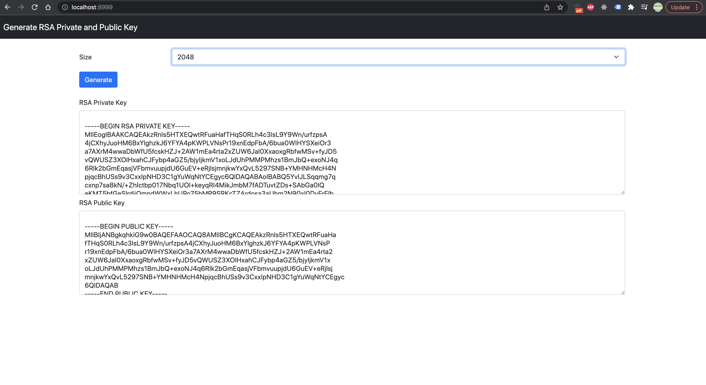

### rsaX

Small Web application that helps you to generate `RSA Private dan Public Key`

#### Building and Running

```shell
$ make build
```

```shell
$ ./webapp
webapp running on port :8999
```

With custom `port`

```shell
$ HTTP_PORT=9001 ./webapp
webapp running on port :9001
```

### Screenshot
[](https://github.com/wuriyanto48)